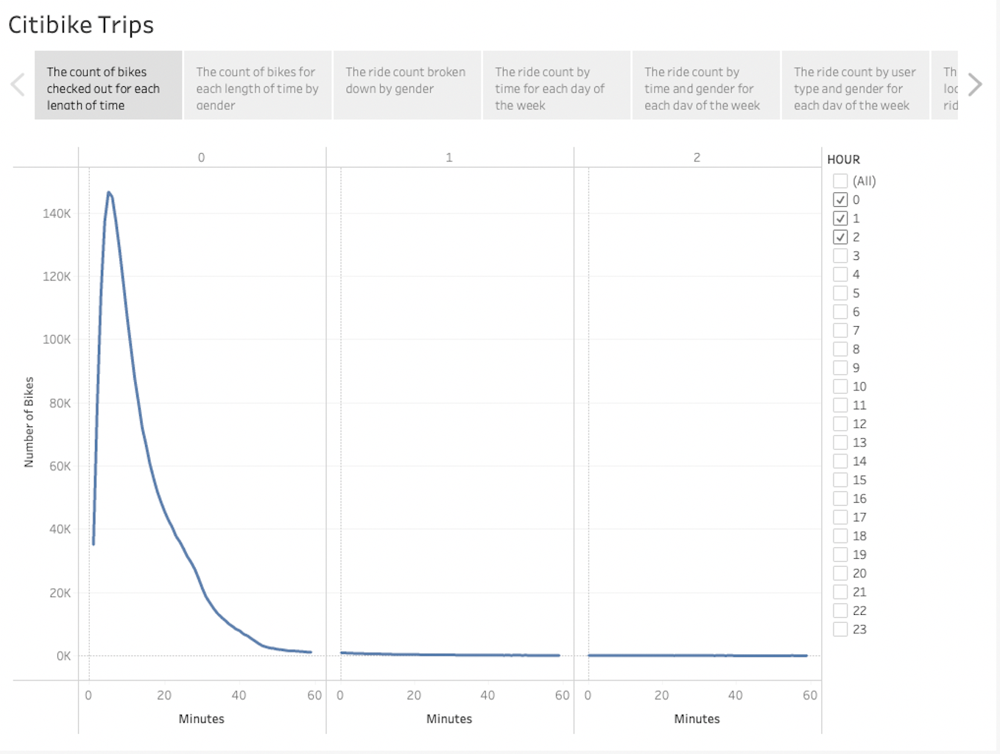
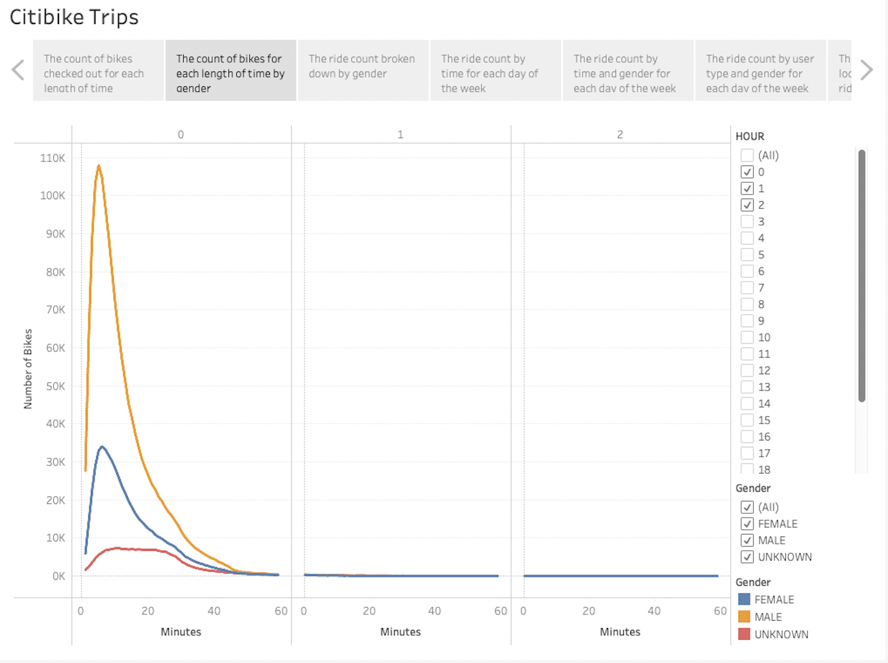
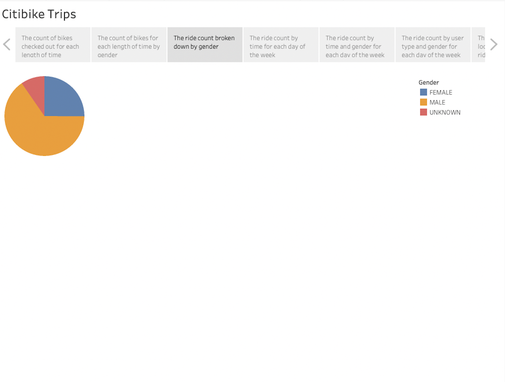
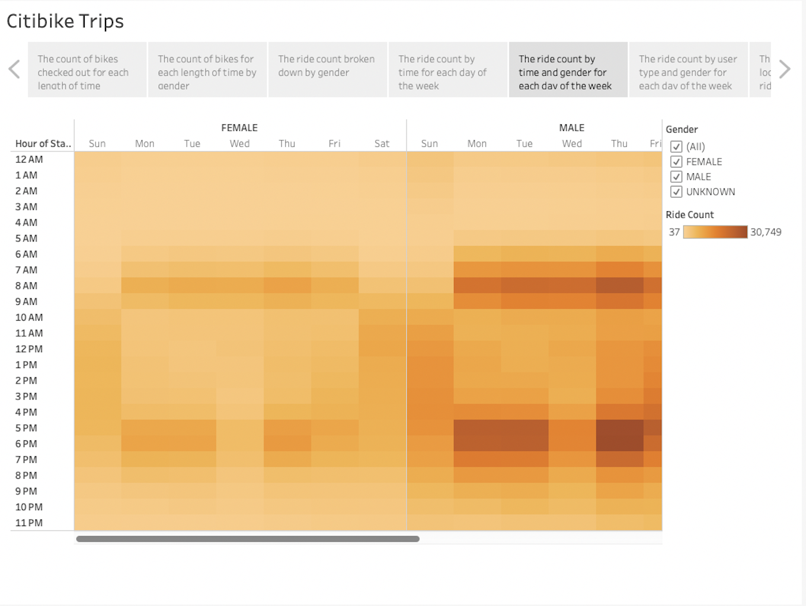
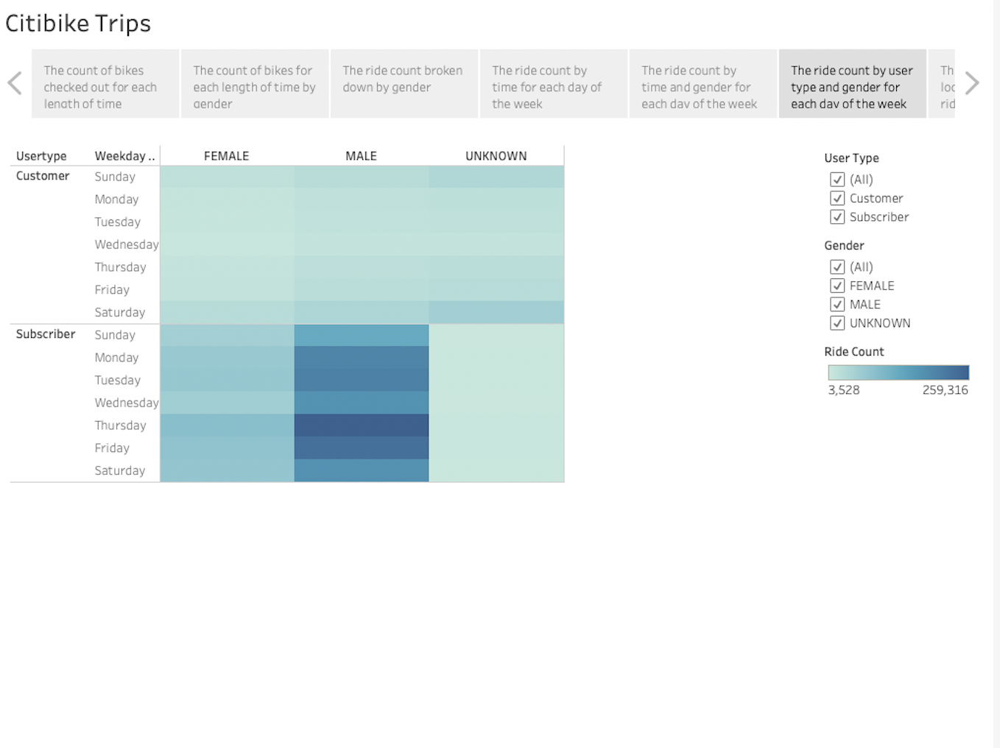
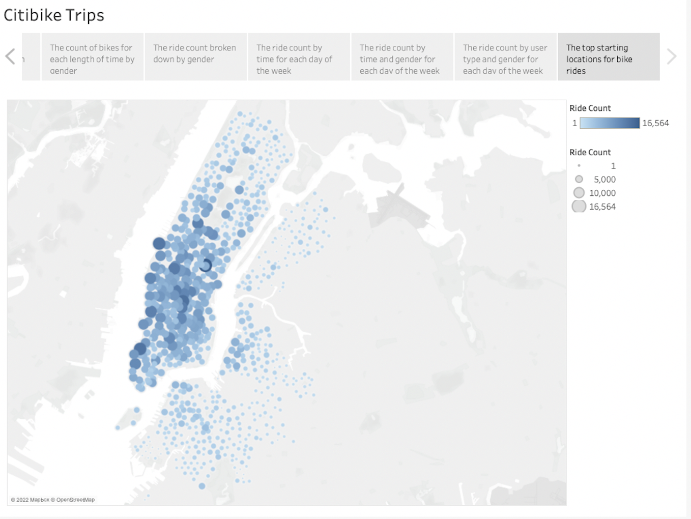
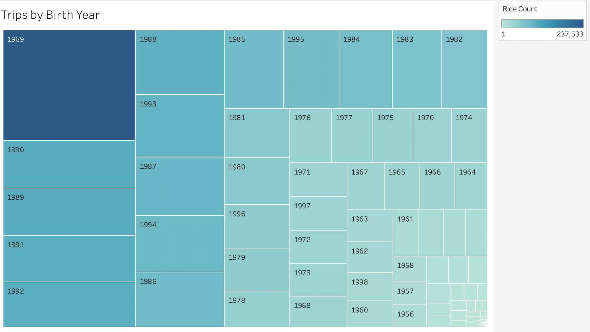
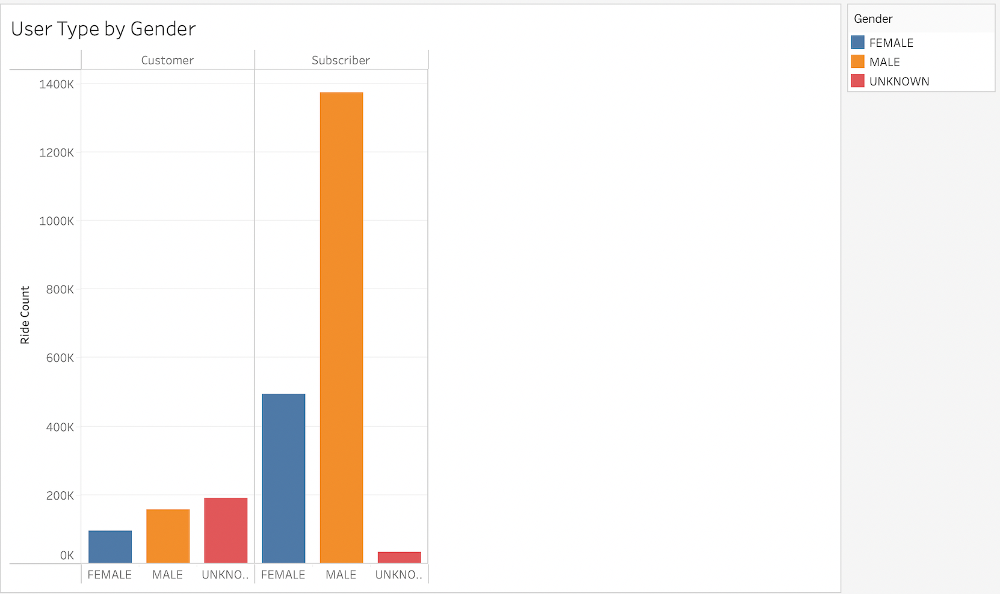

# Tour Des Moines

## Overview
I have some investors lined up to hear a business proposal about a potential bike-sharing program in Des Moines, Iowa. To show that this type of program is viable, I have analyzed the Citibike data for the bike-sharing program in New York City. I will create several visualizations to convice the investors that a bike-sharing program can also be successful in Des Moines. 

---
## Results
I created a Tableau story called Citibike Trips to analyze the Citibike data:

[Citibike Trips Story](https://public.tableau.com/app/profile/brian.rincon/viz/CitibikeTrips_16525574062460/CitibikeTrips)

### Checkout Times for Users
To begin the analysis, I determined the length of time bikes were checked out for:

Even though this visualization is filtered for bike trips of less than 3 hours, it is clear from the graph that the vast majority of bike trips last less than 20 minutes. In fact, the ride length with the peak amount of trips is 5 minutes with a total amount of 146,752.

### Checkout Times by Gender
Next, I seperated the checkout times by the gender categories of male, female and unknown:

It is evident from this visualization that men had by far the highest amount of bike trips with 108,087 trips having a length of 5 minutes, which was the highest amount in terms of the ride length. For women, trips of 6 minutes had the highest ride count of 34,151 trips. In terms of the unknown gender category, trips of 11 minutes were the highest with a ride count of 7,389.

### Gender Breakdown
Finding the checkout times filtered by gender instructive, I decided it would also be helpful to visualize the total ride count by gender as well:

Confirming what was seen in the Checkout Times by Gender, the Gender Breakdown shows that men had the highest total with 1,530,272. Women were next with 588,431 trips and followed by unknown with 225,521 trips.

### Trips by Weekday per Hour
To determine the peak hours for bike trips, I analyzed the amount of trips taken each hour for each day of the week: 

On weekdays, the bike sharing was the busiest from 7AM-10AM and 4PM-9PM, peaking in the 8 o'clock hour in the morning and the 5 and 6 o'clock hours in the afternoon. On Saturdays, the amount bike trips didn't drop below 16,000 from 9AM-9PM, peaking at 31,527 in the 12 o'clock hour. On Sundays, there was a steady flow of bike trips from 11AM-8PM, peaking in the 4 o'clock hour at 23,208.

### Trips by Gender (Weekday per Hour)
Separating the peak hours according to the gender revealed similar results:

For women, the trips also peaked from 8AM-9AM and 5PM-7PM on weekdays, 12PM-1PM on Saturdays and 1PM-2PM on Sundays. For men, the trips peaked from 8AM-9AM and 5PM-7PM on weekdays and 12PM-1PM on Saturdays but from 4PM-5PM on Sundays. In the unknown category, the trips actually peak in the 11 o'clock hour in the morning and the 5 and 6 o'clock hours in the afternoon on weekdays; on Saturdays, 12PM-1PM is the busiest with 5,669 trips and 2PM-3PM is the busiest with 3,813 trips on Sundays.

### User Trips by Gender by Weekday
I also broke down the trips by the two type of users and by gender for each day:

Interestingly, the most trips were taken by Subcribers on Thursdays and Fridays for both men and women but there were more trips for regular customers when the gender was unknown with peaks on Saturdays.

### Top Starting Locations
Lastly, I felt that it was important to know which locations were the most popular to start trips:

While the most popular locations seem to be scattered across Manahattan, the visualizaiton does show the latitude and longitude of each location and help to determine which locations may need more bikes.

---
## Summary
Several important results are evident from the results of the analysis. First of all, it is clear that there are a lot more men using the bike-sharing program. In fact, there are about 2.5 times more bike trips by men. Second of all, the vast majority of the bike trips are around 5 minutes long. It's possible that since there are so many sights so close together in Manhattan, it limits the amount of time people take on their trips. Third of all, the most popular times for bike trips to be taken are 8AM and 5PM-7PM on weekdays and 12PM-6PM on weekends. What is interesting about the data, however, is that Thursdays from 5PM-7PM is by far the busiest for bike trips, with almost 90,000 trips during this time frame. Lastly, subscribers to the bike-sharing program are way more likely to complete a bike trip over regular customers. These results show that getting more women and more non-subscribers to use the bike-sharing program and to promote more bike trips on weekends and possibly longer bike trips as well will allow the bike-sharing program in Des Moines to be as succesful as possible.

### Further Analyses
Additionally, there are further visualizations that may benefit a possible bike-sharing program in Des Moines. Viewing the trips filtered by the birth year of the rider provides a different view of the bike-sharing data:

Interestingly, the birth year with the most rides is 1969 with a ride count of 237,533 followed by several birthdays in the late 1980s and early 1990s. Having a special where parents can ride with their children may help boost sales in Des Moines. 

Lastly, separating the type of user by gender offers a different view of the customers:

While regular customers are pretty evenly separated between female, male and unknown, the subscriber pool is heavily male. Therefore, pushing for more female subscribers is paramount to the success of the bike-sharing program in Des Moines.